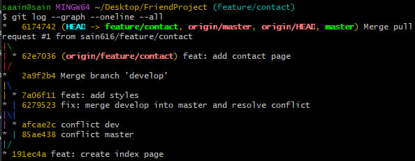
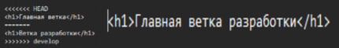
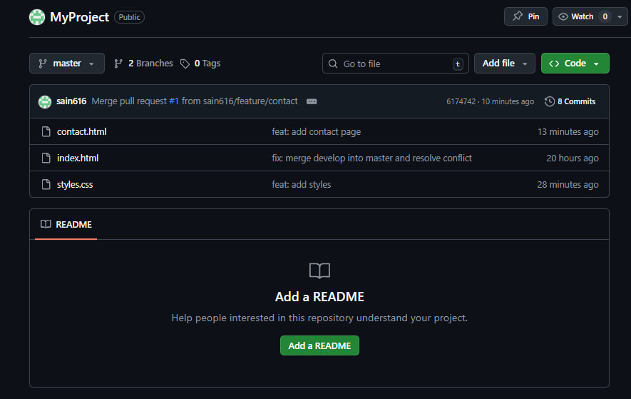

# Отчет по лабораторной работе: Работа с Git и GitHub

## 1. Описание выполненных действий
В ходе лабораторной работы были выполнены следующие этапы:
* **Создание репозитория**: Инициализирован локальный репозиторий `MyProject` и создан файл `index.html`.
* **Работа с ветками**: Создана ветка `develop` для разработки стилей.
* **Создание конфликта**: В ветках `master` и `develop` были внесены разные изменения в одну и ту же строку файла `index.html`.
* **Разрешение конфликта**: Выполнено слияние веток, конфликт разрешен вручную. Итоговый заголовок: "Главная ветка разработки".
* **Стилизация**: Создан файл `styles.css` и подключен к проекту.
* **Работа с удаленным репозиторием**: Проект загружен на GitHub в репозиторий `sain616/MyProject`.
* **Pull Request**: Создана ветка `feature/contact`, добавлен файл `contact.html`, и проведено слияние через Pull Request на GitHub.

## 2. Результаты работы

### Граф веток (git log)
На данном скриншоте видна история коммитов и успешное слияние веток:

### Разрешение конфликта
Скриншот кода после исправления конфликта (выбран вариант "Главная ветка разработки"):

### Репозиторий на GitHub
Итоговый вид проекта со всеми файлами (index.html, styles.css, contact.html):

## 3. Вывод
В результате работы были освоены навыки создания веток, разрешения конфликтов слияния и взаимодействия с удаленным репозиторием через Pull Request.